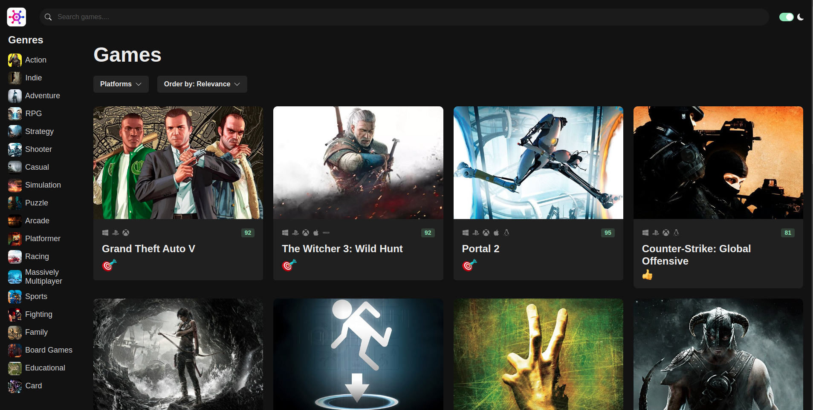

The Gamehub Project is designed to revolutionize how users discover and explore new games. This web app offers an intuitive platform where users can browse, search, and explore a vast collection of games tailored to their preferences and interests.

Powered by smart algorithms, Gamehub personalizes recommendations based on user behavior, genre preferences, and ratings. Whether you're looking for the latest releases or hidden gems, the app ensures you find games that match your tastes effortlessly.

Gamehub supports a wide variety of game categories, including action, adventure, RPG, strategy, and more. The platform’s easy-to-use interface makes it simple to filter, search, and sort through games, while detailed game pages provide in-depth information, reviews, and trailers.

With a focus on seamless user experience, Gamehub also allows users to create and manage wishlists, track favorite games, and receive notifications for upcoming releases and updates.

Designed to scale for a growing database of games, Gamehub offers fast and responsive performance for users across devices. Whether you're a casual gamer or a dedicated enthusiast, this web app is the ultimate tool for discovering your next favorite game.

And the best part is....It's free to use!.
